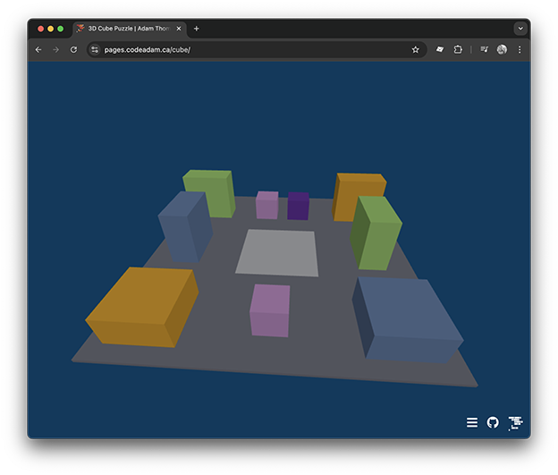

# 3D Cube Puzzle

This is a digital version of the cube puzzle built with LEGO&reg; bricks.

> Details on the puzzle are available at:
> https://activities.codeadam.ca/cube

---

## Project Stack

This project uses only basic HTML. JavaScript, and [Three.js](https://threejs.org/). This project was coded using [GitHub Copilot](https://github.com/features/copilot).

 

---

## Repo Resources

- [GitHUb Copilot](https://github.com/features/copilot)
- [CodThree.js](https://threejs.org/)

 

